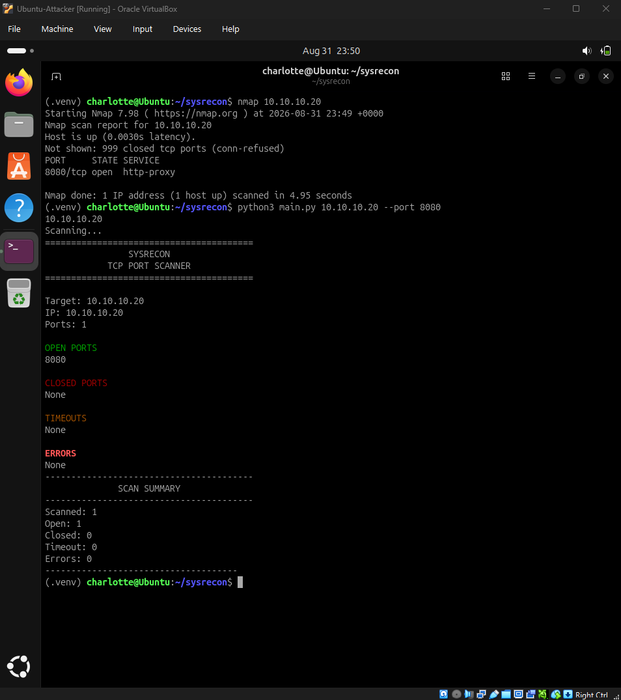

# Sysrecon

## Python Security Reconnaissance CLI Project 

A beginner Python CLI project built to practice Python fundamentals, command-line development, and Git/GitHub workflows.

## Overview

Sysrecon is a Python CLI TCP scanner designed for basic network reconnaissance. Allows for the users to classify an individual port or chosen range of ports as closed, open, timed out, or error.  

## Problem & Application

- Recently I performed a home lab assessment and wanted a deeper understanding of the TCP ports I was scanning. I found that relying solely on existing tools made it much harder to understand what was happening at the socket and connection level.
- This project helped me address that gap. Sysrecon provides clearer classifications for each connection attempt. While teaching me much more along the way furthering my understanding and supplementing my Python fundamentals. 

## Objectives

- Build a functional formatted TCP scanner from zero.
- Develop experience with socket programming.
- Practice command line handling and input validation.
- Apply the tool in a controlled laboratory setting.
- Validated results against Nmap scan. 

## Features

- TCP port scanning
- Host name and IPv4 resolution
- Individual port selection with `--ports`
- Custom ranges with `--start-port` and `--end-port`
- Verbose output with `--verbose`
- `OPEN`, `CLOSED`, `TIMEOUT`, `ERROR` classification
- Port range validation
- Color-coded terminal output
- Various graceful error handling 

## Installation

Clone the repository and navigate into the project directory:

```bash```
```git clone <repository-url>```
```cd python-cli-project```

### Windows
```python -m venv .venv```
```.venv\Scripts\activate```
### Linux
```python3 -m venv .venv```
```source .venv/bin/activate```
### Sysrecon & Dependencies 
```pip install -e .```

## Usage
-Command-Line Arguments
`target` - IP address or hostname to scan
`--ports` - scan specific ports, comma-seperated
`--start-port` - starting point for custom range
`--end-port` - ending point for custom range
`--verbose` - result of each individual port scan. 

`python3 src/sysrecon/main.py 10.10.10.20 --ports 8080`
`python3 src/sysrecon/main.py 10.10.10.20 --start-port 8078 --end-port 8082`
`python3 src/sysrecon/main.py 10.10.10.20 --ports 8080 --verbose`

## Validation

- SysRecon was tested in an isolated VM environment, and its results were compared against Nmap using the same target and port configuration. Both tools successfully identified the intentionally exposed TCP port.


## Limitations

- TCP scanning only
- Sequential scanning
- No UDP scanning
- No service or version detection
- No operating system detection
- No CIDR or subnet scanning
- No result export
- Fixed 1-second connection timeout
- Designed for basic reconnaissance rather than replacing advanced tools such as Nmap

## V2 — Coming Soon...

- Concurrent port scanning
- UDP scanning
- Service/version detection
- JSON/CSV result export
- Configurable timeouts
- CIDR/subnet scanning
- Automated testing
